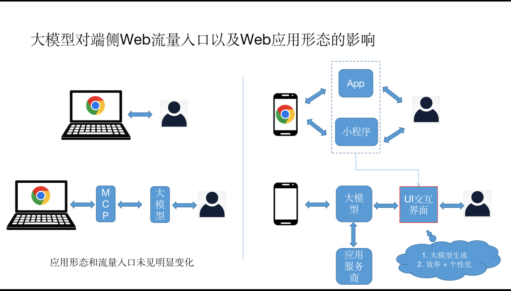
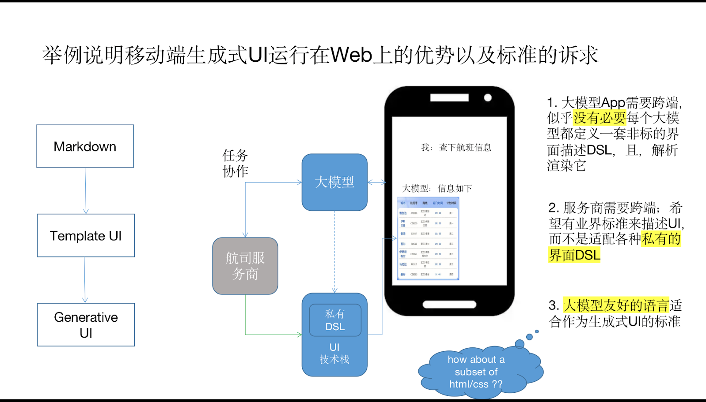

** NOTE: This is a machine-translated document and is provided for reference only. In case of any discrepancies, the [Chinese version](/report-zh.md) shall prevail. **

# Summary of the Generative UI Meeting on 2026-01-29

* [1. Event Introduction](#1-event-introduction)
* [2. Opening Discussion (Hu Chunming, Wang Zuo)](#2-opening-discussion-hu-chunming-wang-zuo)
* [3. Industry Sharing](#3-industry-practice-sharing)

  * [Lu Chen (Ant Group)](#1-lu-chen-ant-group)
  * [Mo Chunhui (Huawei)](#2-mo-chunhui-huawei)
  * [Zu Ming (Baidu)](#3-zu-ming-baidu)
* [Open Discussion](#open-discussion)

  * [Q1: Performance and Load Speed](#q1-is-loading-speed-still-important-for-ai-generated-ui-in-chat-scenarios)
  * [Q2: Standards Collaboration and Ecosystem](#q2-how-to-optimize-platforms-and-ecosystems-through-standards-collaboration)
  * [Q3: UI Components](#q3-ui-components)
  * [Q4: Web Subsets](#q4-web-subsets)
  * [Q5: Testing and Validation](#q5-testing-and-validation)
* [Conclusions and Next Steps](#conclusions-and-next-steps)

---

## 1. Event Introduction

With the rapid development of large models and generative AI, **Generative UI** has become a highly focused area in the industry. While exploring multiple technical paths in this field, the industry is also facing new challenges including performance efficiency, security risks, scalability, and interoperability.

To further discuss the development trends and standardization possibilities of Generative UI in the Web domain, **W3C China** organized a special online workshop on **January 29, 2026**, with participation from **over 50 representatives** from W3C member organizations.

---

## 2. Opening Discussion (Hu Chunming, Wang Zuo)

The meeting was opened by **Prof. Hu Chunming (W3C Board member, Beihang University)** and **Dr. Wang Zuo (Huawei Fields Lab)**, who shared their insights.

**Prof. Hu Chunming** pointed out that AI-assisted software development in the Web domain is gradually shifting its focus toward **front-end UI**. With large models and agents participating in human-computer interaction, UI is becoming a new critical interaction layer. Currently, MCP/Agents widely adopt Generative UI, expressing interaction requirements via **Markdown, HTML, or other DSLs**.

He raised several discussion points on the future expression layer and standardization possibilities:

* Should standards **extend capabilities on top of Markdown**, or **simplify HTML**?
* How can Generative UI achieve a **balance between generation and constraints** under AI assistance?
* W3C explorations in **HTML/CSS high-performance subsets, mini-app forms, and “meta-services”** are highly relevant to these topics.

He also mentioned that the **W3C Advisory Committee Meeting ([AC 2026](https://www.w3.org/zh-hans/events/))** will be held in **Hangzhou, China**, and reaching some preliminary consensus beforehand could facilitate deeper discussions.

---

**Dr. Wang Zuo** shared observations on **“Deep UI”** from the perspective of changes in Web entry points and application forms with the rise of large models:

* **PC:** Users still primarily interact with models via browsers, with models manipulating web pages via the Web core and MCP.
* **Mobile:** Service distribution is increasingly handled by models, and traditional Web pages in Apps or mini-programs are transitioning to **model-generated UI**.

Such UI provides higher production efficiency and stronger real-time personalization, becoming an important interface for future human-computer interaction.

In terms of technical evolution, he noted the industry has progressed from Markdown-based rendering to template-based UI, and now toward finer-grained, model-generated interface expressions. Currently, major models and platforms often define private UI tech stacks, which increases cross-platform adaptation and service integration costs. He suggested exploring a **model-friendly, cross-platform universal standard language**, and proposed this as a direction for W3C standardization discussions.

---

**Ran Ruoxi**, W3C team member and [Web & AI Interest Group](https://www.w3.org/groups/ig/webai/) contact, chaired the discussion. She highlighted that as large models and agent technologies evolve, UI is shifting from static design and template composition to **on-demand generation and dynamic adaptation**. Generative UI is often autonomously created by models, posing new challenges and opportunities for Web architecture, interaction, and standards. W3C aims to understand real-world practices and explore how these technologies might fit into future Web standards.

---

## 3. Industry Practice Sharing

Several industry experts shared their understanding and experience with Generative UI.

### 1. Lu Chen (Ant Group)

📄 PPT:
[https://www.w3.org/2026/01/GenUI-China/Perspectives_of_Generative_UI_RH.pptx](https://www.w3.org/2026/01/GenUI-China/Perspectives_of_Generative_UI_RH.pptx)

Lu Chen shared insights based on Ant Group and industry practices:

* With the rapid evolution of large model coding capabilities and coding agents, confidence in using large models to generate Web pages and applications has grown, making Generative UI a key focus.
* The approach of generating complete HTML overlaps with AI coding, prompting rethinking of Generative UI definitions and priorities.

He analyzed three technical paths: Markdown, DSL, and direct HTML generation, noting growing interest in HTML direct output and DSL solutions. Direct HTML provides maximum expressiveness but poses challenges in security, performance, and infrastructure cost; DSL solutions offer safer, more consistent, and modular rendering but remain fragmented due to low-cost proprietary implementations.

He suggested standardization efforts focus on three areas:

* Explore lightweight, model-friendly Web subsets to improve security
* Research better sandboxing and isolation mechanisms
* Promote a cross-vendor Generative UI intermediate protocol to enable future ecosystem collaboration

---

### 2. Mo Chunhui (Huawei)

📄 PPT:
[https://www.w3.org/2026/01/GenUI-China/Generative_UI_Technology_Insights_MCH.pptx](https://www.w3.org/2026/01/GenUI-China/Generative_UI_Technology_Insights_MCH.pptx)

Mo Chunhui analyzed the technical essence and implementation of Generative UI from an engineering perspective. He emphasized that the core of Generative UI lies in **real-time generation**, not template-driven selection. Models need to dynamically generate page structures, component types, layouts, and interaction logic based on user intent and context. Most current implementations are still design-time template systems, with AI only assisting parameters or decisions, limiting coverage for long-tail scenarios.

He proposed **“scenario coverage”** as a key metric for generative capability. Technically, Generative UI will evolve from template-based, to atomically composed components, and ultimately to fully generative systems, demanding higher runtime and standardization capabilities.

He compared JSON and XML DSLs, noting XML benefits front-end parsing and real-time rendering in streaming or incomplete scenarios. He emphasized unified rendering architecture for Web and native consistency and safety guardrails. For multi-page generation, he proposed **“generative mini-programs”** to coordinate AI across pages, supporting complex business workflows. Generative UI should support enterprise-owned components and mixed outputs of text, structured UI, and DSL.

Next work priorities include:

* Explore browser kernel capability requirements
* Promote Generative UI standardization
* Define safety guardrails
* Build a more universal DSL
* Research multi-platform unified rendering frameworks

---

### 3. Zu Ming (Baidu)

Zu Ming introduced Baidu’s current work on Generative UI. Their approach aligns closely with previous speakers.

Since early 2023, Baidu has extended Markdown to support richer components in conversational product forms. In building agent ecosystems, they also introduced JSON DSL to enable UI layout and interaction while reducing developer integration costs. Over the years, this has matured into a relatively complete solution.

By the end of last year, Baidu consolidated its technology stack—including protocols, rendering engines, and component libraries—and open-sourced it 👉 [https://github.com/baidu/cosui/](https://github.com/baidu/cosui/)

Current research focuses on directly generating code via large models to deliver richer interactive applications in search scenarios. Common challenges align with those mentioned by other speakers, prompting further industry collaboration.

---

## Open Discussion

### Q1: Is loading speed still important for AI-generated UI in chat scenarios?

**Wang Zuo:**
In traditional mobile tech, there was an evolution from “native → Web → cross-platform stacks,” aiming to approach native performance while keeping cross-platform benefits. Users historically disliked “slow-loading” Web pages.

In AI chat and generative scenarios, user expectations shift: they view the system as a **thinking agent**, tolerating longer response times. Thus, the importance of loading speed may differ from traditional applications. How do different companies consider this in real product design?

**Zu Ming:**
In Baidu Search, performance remains important and is a major operational constraint.

**Ran Ruoxi:**
I would add that users currently tolerate some thinking time from large models, but long-term expectations may rise as with historical Web development. The challenge is balancing **performance, flexibility, and experience**.

**Mo Chunhui:**
From a performance metric perspective, two key indicators for large models are TTFT (Time To First Token) and TPOT (Time Per Output Token). Generative UI could adopt similar metrics:

* Time to first visible feedback
* Progressive rendering of UI elements
* Output intervals per text token or UI component

A quantitative metric system for Generative UI can unify evaluation and improve real user experience.

---

### Q2: How to optimize platforms and ecosystems through standards collaboration

**Wang Zuo:**
Many vendors have private UI standards, increasing integration costs. As large models become service distribution platforms, a unified standard for UI descriptions—whether HTML/CSS or DSL—can benefit developers, service providers, and the ecosystem.

**Hu Chunming:**
Two points:

1. Final UI rendering requires a standard. Regardless of output format, a runtime environment is needed to parse and display UI.
2. Cross-vendor standardization can prevent repeated wheel reinvention and enable multiple models or services to jointly generate consistent UI, respecting brand consistency.

---

### Q3: UI Components

**Mo Chunhui:**
Component convergence is a core challenge. Different vendors use diverse component libraries, making unified adoption difficult. Web standards (Web Components) provide a feasible convergence path. ADSL can describe component usage, letting models generate UI without depending on specific libraries.

---

### Q4: Web Subsets

**Wu Xiaoqian:**
Introduced W3C MiniApps, High-Performance Web Apps, WebView, IWA, and PWA Widget group discussions.

**Xue Fuqiao:**
Generative UI can evolve along two directions:

* Direct Web page generation (HTML/CSS/JS)
* Component-based limited cards (JS/XML rendered via component libraries)

Both can coexist. Safe subsets, sandboxing, and standardized DSL can balance flexibility, security, and cross-platform rendering.

---

### Q5: Testing and Validation

**Wang Zuo:**
Generative UI testing cannot fully rely on manual verification; automated testing and virtualized environments are necessary. Some companies already generate test cases via models and validate them automatically before delivery.

**Ran Ruoxi:**
Accessibility is critical. W3C could develop an open-source testing platform for automated validation of accessibility and other key quality metrics.

**Xue Fuqiao:**
Automated testing could include:

* Capturing generated UI
* Comparing UI with user intent
* Auto-repairing until validation passes

This provides quantifiable evaluation and supports standardization.

---

## Conclusions and Next Steps

The Generative UI Community Group was established after the meeting, with future focus on:

* **Evaluation and Performance:** Define and assess latency, response, and output quality; identify gaps in W3C standards.
* **Validation and Testing:** Develop methods beyond traditional end-to-end testing, including structured test cases and reference implementations.
* **Intermediate Representation:** Explore lightweight, cross-vendor protocols to improve interoperability and model compatibility.
* **Alignment with Web Platform:** Assess if Generative UI can leverage a lightweight Web subset while adhering to Web principles.

Join the [Generative UI Community Group](https://www.w3.org/groups/cg/gen-ui/) to participate in discussions.
